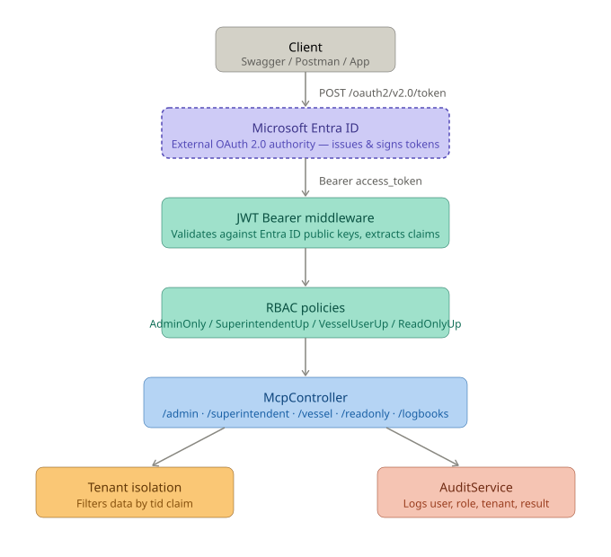

# MCP Logbook API — OAuth 2.0 + Microsoft Entra ID

A proof of concept demonstrating secure access to a maritime logbook system using **OAuth 2.0 via Microsoft Entra ID**, Role-Based Access Control (RBAC), multi-tenant data isolation, and audit logging — built with ASP.NET Core 8.



---

## Table of Contents

1. [Project Overview](#project-overview)
2. [Project Structure](#project-structure)
3. [Tech Stack](#tech-stack)
4. [Setup & Run](#setup--run)
5. [Configuration](#configuration)
6. [Entra ID Setup](#entra-id-setup)
7. [File-by-File Breakdown](#file-by-file-breakdown)
   - [Program.cs](#programcs)
   - [Services/AuditService.cs](#servicesauditservicecs)
   - [Middleware/ObservabilityMiddleware.cs](#middlewareobservabilitymiddlewarecs)
   - [Controllers/McpController.cs](#controllersmcpcontrollercs)
   - [Controllers/AuditController.cs](#controllersauditcontrollercs)
8. [Authentication Flow (OAuth 2.0)](#authentication-flow-oauth-20)
9. [Entra ID JWT Claims](#entra-id-jwt-claims)
10. [Roles & Permission Matrix](#roles--permission-matrix)
11. [Tenant Isolation](#tenant-isolation)
12. [Audit Logging](#audit-logging)
13. [Unit Tests](#unit-tests)
14. [Sample Test Users](#sample-test-users)

---

## Project Overview

This API simulates a maritime MCP (Marine Cyber Platform) logbook system where different shipboard roles have different levels of access. It uses **OAuth 2.0 with Microsoft Entra ID** as the external authorization server — the API never issues or stores tokens, it only validates them.

**Key security features:**
- **OAuth 2.0 / Entra ID** — tokens are issued by Microsoft, not by this API
- **RBAC (Role-Based Access Control)** — endpoints locked to specific roles via named policies
- **Multi-Tenant Isolation** — users only see logbook data belonging to their own company
- **Audit Logging** — every access attempt (authorized or denied) is recorded with full context

---

## Project Structure

```
McpLogbook/
├── README.md
├── mcp-logbook/
│   └── McpLogbookApi/
│       ├── Controllers/
│       │   ├── McpController.cs            # Protected logbook endpoints (RBAC)
│       │   └── AuditController.cs          # Audit log retrieval endpoints
│       ├── Middleware/
│       │   └── ObservabilityMiddleware.cs  # Captures 401/403 failed requests
│       ├── Services/
│       │   └── AuditService.cs             # Records and retrieves audit log entries
│       ├── appsettings.json                # Entra ID config, log file path
│       └── Program.cs                      # App bootstrap, DI, middleware pipeline
└── McpLogbookApi.Tests/
    ├── AuditServiceTests.cs                # Unit tests for AuditService
    └── McpLogbookApi.Tests.csproj          # Test project config
```


---

## Tech Stack

| Technology | Purpose |
|---|---|
| ASP.NET Core 8 Web API | HTTP server and routing |
| OAuth 2.0 / Microsoft Entra ID | External authorization server — issues all tokens |
| JWT Bearer (`Microsoft.AspNetCore.Authentication.JwtBearer`) | Validates Entra ID tokens on every request |
| OpenID Connect Discovery | Automatically fetches Entra ID signing keys |
| Swagger / Swashbuckle | API documentation with Bearer token UI |
| xUnit | Unit testing framework |

---

## Setup & Run

### Prerequisites

- [.NET 8 SDK](https://dotnet.microsoft.com/download/dotnet/8.0)
- An active Microsoft Entra ID (Azure AD) tenant
- Visual Studio 2022 or Visual Studio Code

### Steps

```bash
git clone https://github.com/Navyanaweli/mcp-logbook-poc.git
cd mcp-logbook-poc/mcp-logbook/McpLogbookApi
dotnet restore
dotnet run
```

Swagger UI will be available at:

```
https://localhost:{port}/swagger
```

### Running Tests

```bash
cd McpLogbookApi.Tests
dotnet test
```

---

## Configuration

All Entra ID and logging settings live in `appsettings.json`:

```json
{
  "AzureAd": {
    "TenantId": "your-entra-tenant-id",
    "ClientId": "your-entra-client-id",
    "Authority": "https://login.microsoftonline.com/your-entra-tenant-id/v2.0"
  },
  "AuditLog": {
    "FilePath": "audit-log.jsonl"
  }
}
```

| Key | Description |
|---|---|
| `AzureAd:TenantId` | Your Entra ID directory (tenant) ID |
| `AzureAd:ClientId` | Your registered app's client ID — used as the token audience |
| `AzureAd:Authority` | Entra ID token endpoint — API fetches signing keys from here automatically |
| `AuditLog:FilePath` | File where audit entries are appended as JSON lines |

> Replace all `your-entra-*` placeholder values with your real Entra ID app registration details.

---

## Entra ID Setup

Follow these steps to connect the API to Microsoft Entra ID:

**1. Register the API app**
- Go to [Azure Portal](https://portal.azure.com) → **Azure Active Directory** → **App Registrations** → **New Registration**
- Name it `McpLogbookApi`
- Copy the **Application (client) ID** → paste into `AzureAd:ClientId`
- Copy the **Directory (tenant) ID** → paste into `AzureAd:TenantId`
- Update `AzureAd:Authority` with your tenant ID

**2. Add App Roles**
- In your app registration → **App Roles** → **Create App Role** for each role:

| Role Display Name | Value | Assigned to |
|---|---|---|
| Administrator | `Administrator` | Users / Groups |
| Superintendent | `Superintendent` | Users / Groups |
| VesselUser | `VesselUser` | Users / Groups |
| ReadOnlyUser | `ReadOnlyUser` | Users / Groups |

**3. Assign roles to users**
- Go to **Enterprise Applications** → find your app → **Users and Groups** → **Add User** → assign a role

**4. Get a token for testing**
```
POST https://login.microsoftonline.com/{tenant-id}/oauth2/v2.0/token
Content-Type: application/x-www-form-urlencoded

grant_type=password
&client_id={client-id}
&username={user@yourdomain.com}
&password={password}
&scope=api://{client-id}/.default
```

Paste the returned `access_token` into the Swagger **Authorize** field as `Bearer <token>`.

---

## File-by-File Breakdown

---

### Program.cs

**Path:** `mcp-logbook/McpLogbookApi/Program.cs`

The application entry point. Registers services, configures OAuth, and sets up the middleware pipeline.

**1. Core Services**
```csharp
builder.Services.AddSingleton<AuditService>();
```
Registered as a Singleton so the in-memory audit log persists across all requests. `JwtService` has been removed — Entra ID handles token issuance entirely.

**2. OAuth 2.0 / Entra ID Authentication**
```csharp
options.Authority = azureAd["Authority"];
options.Audience  = azureAd["ClientId"];
```
By setting `Authority`, ASP.NET Core automatically fetches the OpenID Connect discovery document from Entra ID and downloads the public signing keys. There is no hardcoded secret key — Microsoft's public key infrastructure is used instead.

```csharp
NameClaimType = "preferred_username",
RoleClaimType = "roles"
```
Maps Entra ID's claim names to standard ASP.NET Core claim types so `ClaimTypes.Name` and `ClaimTypes.Role` work correctly throughout the app.

**3. Authorization Policies**
```csharp
options.AddPolicy("AdminOnly",        policy => policy.RequireRole("Administrator"));
options.AddPolicy("SuperintendentUp", policy => policy.RequireRole("Administrator", "Superintendent"));
options.AddPolicy("VesselUserUp",     policy => policy.RequireRole("Administrator", "Superintendent", "VesselUser"));
options.AddPolicy("ReadOnlyUp",       policy => policy.RequireRole("Administrator", "Superintendent", "VesselUser", "ReadOnlyUser"));
```
These policies read the `roles` claim from the Entra ID token. No changes needed here when moving from local JWT to OAuth.

**4. Middleware Pipeline**
```csharp
app.UseMiddleware<ObservabilityMiddleware>(); // must come before auth
app.UseAuthentication();
app.UseAuthorization();
```
Order matters — `ObservabilityMiddleware` must wrap auth so it can see and log 401/403 failures after they are produced.

---

### Services/AuditService.cs

**Path:** `mcp-logbook/McpLogbookApi/Services/AuditService.cs`

Records every API event for security and compliance. Unchanged from the JWT version — it only stores and retrieves entries, with no dependency on how tokens are issued.

**`Log(...)` method** — Takes 10 parameters, creates an `AuditEntry`, adds it to the in-memory list, emits a structured log line, and optionally appends a JSON line to the audit file.

**`AuditEntry` record fields:**

| Field | Description |
|---|---|
| `User` | Username from the `preferred_username` claim |
| `Role` | Role from the `roles` claim |
| `TenantId` | Tenant from the `tid` claim |
| `ClientId` | Value of the `X-Client-Id` request header |
| `Action` | Endpoint that was accessed |
| `AuthResult` | `"Authorized"` / `"Denied"` / `"Unauthenticated"` |
| `ExecutionStatus` | `"Success"` / `"NotFound"` / `"Error"` / `"Blocked"` |
| `HttpMethod` | GET, POST, etc. |
| `StatusCode` | HTTP response code |
| `DurationMs` | Request duration in milliseconds |
| `Timestamp` | UTC time the event occurred |

---

### Middleware/ObservabilityMiddleware.cs

**Path:** `mcp-logbook/McpLogbookApi/Middleware/ObservabilityMiddleware.cs`

Intercepts requests rejected by the authentication or authorization layer and logs them to `AuditService`.

**Why it exists:** Controllers only run when a request passes auth. If a request is rejected with 401 or 403, no controller runs — so this middleware catches those failures.

**Entra ID claim names used:**
```csharp
var user     = context.User?.FindFirstValue("preferred_username") ?? "anonymous";
var role     = context.User?.FindFirstValue("roles") ?? "unknown";
var tenantId = context.User?.FindFirstValue("tid") ?? "unknown";
```

- `401 Unauthenticated` — no valid Entra ID token was provided
- `403 Denied` — token was valid but the role was not sufficient for the endpoint

---

### Controllers/McpController.cs

**Path:** `mcp-logbook/McpLogbookApi/Controllers/McpController.cs`

**Route:** `api/mcp`

The main protected resource controller. All endpoints require a valid Entra ID token.

**Entra ID claim helpers:**
```csharp
private string TenantId => User.FindFirstValue("tid") ?? "unknown";
private string Username => User.FindFirstValue(ClaimTypes.Name) ?? "unknown";  // preferred_username
private string Role     => User.FindFirstValue(ClaimTypes.Role) ?? "unknown";  // roles
private string ClientId => Request.Headers["X-Client-Id"].FirstOrDefault() ?? "unknown";
```

The `tid` claim is the Entra ID **tenant ID** — a unique GUID per organization. This is what drives tenant isolation.

**Endpoints:**

| Method | Route | Policy | Access |
|---|---|---|---|
| GET | `/api/mcp/admin` | `AdminOnly` | Administrator only |
| GET | `/api/mcp/superintendent` | `SuperintendentUp` | Administrator + Superintendent |
| GET | `/api/mcp/vessel` | `VesselUserUp` | Administrator + Superintendent + VesselUser |
| GET | `/api/mcp/readonly` | `ReadOnlyUp` | All four roles |
| GET | `/api/mcp/logbooks` | `ReadOnlyUp` | All four roles (filtered by `tid`) |

---

### Controllers/AuditController.cs

**Path:** `mcp-logbook/McpLogbookApi/Controllers/AuditController.cs`

**Route:** `api/audit`

Exposes audit log retrieval. Uses the `tid` claim from the Entra ID token to scope results per tenant.

**`GET /api/audit/all`** — `AdminOnly`
Returns the full audit log across all tenants.

**`GET /api/audit/my-tenant`** — `SuperintendentUp`
Returns only entries where `TenantId` matches the calling user's `tid` claim.

---

## Authentication Flow (OAuth 2.0)

With Entra ID, this API is a **resource server** — it never issues tokens. Clients obtain tokens directly from Microsoft.

```
Client                     Entra ID                    API
  |                            |                         |
  |  POST /oauth2/v2.0/token   |                         |
  |  { client_id, credentials }|                         |
  |--------------------------->|                         |
  |                            |  Validates credentials  |
  |  { access_token }          |                         |
  |<---------------------------|                         |
  |                                                      |
  |  GET /api/mcp/logbooks                               |
  |  Authorization: Bearer <access_token>                |
  |----------------------------------------------------->|
  |                                                      |  Fetches Entra ID public keys
  |                                                      |  (from Authority discovery endpoint)
  |                                                      |  Validates signature, expiry, audience
  |                                                      |  Extracts tid, preferred_username, roles
  |                                                      |  Checks ReadOnlyUp policy
  |                                                      |  Filters logbooks by tid
  |                                                      |  AuditService.Log() called
  |  200 OK { logbooks }                                 |
  |<-----------------------------------------------------|
```

---

## Entra ID JWT Claims

Entra ID tokens use different claim names from a locally issued JWT:

| What | Old (local JWT) | Entra ID claim |
|---|---|---|
| Username | `ClaimTypes.Name` | `preferred_username` |
| Role | `ClaimTypes.Role` | `roles` |
| Tenant | `TenantId` (custom) | `tid` (built-in) |

The `TokenValidationParameters` in `Program.cs` maps these so the rest of the app still uses standard ASP.NET Core claim types.

---

## Roles & Permission Matrix

Roles are assigned in Entra ID as **App Roles** and arrive in the token's `roles` claim.

| Endpoint | Administrator | Superintendent | VesselUser | ReadOnlyUser |
|---|:---:|:---:|:---:|:---:|
| `GET /api/mcp/admin` | ✅ | ❌ | ❌ | ❌ |
| `GET /api/mcp/superintendent` | ✅ | ✅ | ❌ | ❌ |
| `GET /api/mcp/vessel` | ✅ | ✅ | ✅ | ❌ |
| `GET /api/mcp/readonly` | ✅ | ✅ | ✅ | ✅ |
| `GET /api/mcp/logbooks` | ✅ | ✅ | ✅ | ✅ |
| `GET /api/audit/all` | ✅ | ❌ | ❌ | ❌ |
| `GET /api/audit/my-tenant` | ✅ | ✅ | ❌ | ❌ |

---

## Tenant Isolation

Every Entra ID token contains a `tid` claim — a GUID uniquely identifying the user's organization. The `/api/mcp/logbooks` endpoint filters logbook data by this value:

```csharp
private string TenantId => User.FindFirstValue("tid") ?? "unknown";

var logbooks = GetMockLogbooks().Where(l => l.TenantId == TenantId).ToList();
```

A user from one organization cannot see another organization's data — even with the same role. The `tid` value is set by Entra ID and cannot be forged because the token is signed by Microsoft's private key.

> **Note:** In the mock data, tenant IDs use friendly names like `nordic-shipping`. In a real Entra ID deployment, `tid` would be a GUID like `72f988bf-86f1-41af-91ab-2d7cd011db47`. You would need a lookup table to map GUIDs to names.

---

## Audit Logging

Every request to a protected endpoint is logged — both successes and failures. The `ObservabilityMiddleware` captures 401/403 failures before they reach any controller.

**Audit log file (`audit-log.jsonl`):**
Each entry is a single JSON line, making it easy to parse or load into a SIEM / log aggregator.

**Example entry:**
```json
{
  "User": "alice@company.com",
  "Role": "Administrator",
  "TenantId": "72f988bf-86f1-41af-91ab-2d7cd011db47",
  "ClientId": "claude-3",
  "Action": "Accessed /api/mcp/admin",
  "AuthResult": "Authorized",
  "ExecutionStatus": "Success",
  "HttpMethod": "GET",
  "StatusCode": 200,
  "DurationMs": 5,
  "Timestamp": "2025-06-30T10:00:00Z"
}
```

---

## Unit Tests

**Path:** `McpLogbookApi.Tests/`

The test suite has two files covering both service logic and full HTTP authorization behaviour. All 23 tests pass.

```bash
dotnet test McpLogbookApi.Tests
```

---

### AuditServiceTests.cs

Tests `AuditService` in complete isolation using a `NoOpLogger`. No HTTP stack involved.

| Test | What it verifies |
|---|---|
| `Log_AddsEntryToList` | A logged entry is stored with all fields correct |
| `GetLogsForTenant_ReturnsOnlyMatchingTenant` | Cross-tenant entries are excluded |
| `GetLogsForTenant_ReturnsEmpty_WhenNoMatch` | Unknown tenant returns empty list |
| `GetLogs_ReturnsAllLogs` | All entries across all tenants are returned |

---

### AuthorizationTests.cs

Integration tests that boot the **real ASP.NET Core app** via `WebApplicationFactory` and send actual HTTP requests. The Entra ID token validation is overridden with a local HMAC key so tests run offline — no Azure connection needed. The same claim names (`preferred_username`, `roles`, `tid`) and claim mappings (`MapInboundClaims = false`) used in production are applied in tests, so the policies behave identically.

**Unauthenticated:**

| Test | What it verifies |
|---|---|
| `NoToken_Returns401` | Missing token → 401 |
| `InvalidToken_Returns401` | Garbage token string → 401 |

**Role-Based Access Control (per endpoint):**

| Test | What it verifies |
|---|---|
| `Administrator_CanAccess_AdminEndpoint` | Admin → 200 on `/api/mcp/admin` |
| `Superintendent_CannotAccess_AdminEndpoint` | Superintendent → 403 on `/api/mcp/admin` |
| `VesselUser_CannotAccess_AdminEndpoint` | VesselUser → 403 on `/api/mcp/admin` |
| `ReadOnlyUser_CannotAccess_AdminEndpoint` | ReadOnly → 403 on `/api/mcp/admin` |
| `Superintendent_CanAccess_SuperintendentEndpoint` | Superintendent → 200 on `/api/mcp/superintendent` |
| `VesselUser_CannotAccess_SuperintendentEndpoint` | VesselUser → 403 on `/api/mcp/superintendent` |
| `VesselUser_CanAccess_VesselEndpoint` | VesselUser → 200 on `/api/mcp/vessel` |
| `ReadOnlyUser_CannotAccess_VesselEndpoint` | ReadOnly → 403 on `/api/mcp/vessel` |
| `ReadOnlyUser_CanAccess_ReadonlyEndpoint` | ReadOnly → 200 on `/api/mcp/readonly` |
| `Administrator_CanAccess_ReadonlyEndpoint` | Admin satisfies all policies |

**Tenant Isolation:**

| Test | What it verifies |
|---|---|
| `Logbooks_ReturnsOnlyOwnTenantData` | `nordic-shipping` user sees no `pacific-maritime` data |
| `Logbooks_DifferentTenants_DoNotShareData` | `pacific-maritime` user sees no `nordic-shipping` data |
| `Logbooks_UnknownTenant_Returns404` | Tenant with no logbooks → 404 |

**Audit Endpoints:**

| Test | What it verifies |
|---|---|
| `Administrator_CanAccess_AllAuditLogs` | Admin → 200 on `/api/audit/all` |
| `Superintendent_CanAccess_TenantAuditLogs` | Superintendent → 200 on `/api/audit/my-tenant` |
| `Superintendent_CannotAccess_AllAuditLogs` | Superintendent → 403 on `/api/audit/all` |
| `VesselUser_CannotAccess_AuditLogs` | VesselUser → 403 on `/api/audit/my-tenant` |

**Expected output:**
```
Passed! - Failed: 0, Passed: 23, Skipped: 0, Total: 23
```

---

## Sample Test Users

Create these users in your Entra ID tenant and assign them the corresponding App Role:

| Username | App Role | Notes |
|---|---|---|
| `alice@yourdomain.com` | `Administrator` | Full access, all tenants in audit |
| `bob@yourdomain.com` | `Superintendent` | Can approve logbooks, view own tenant audit |
| `charlie@yourdomain.com` | `VesselUser` | Can submit logbook entries |
| `diana@yourdomain.com` | `ReadOnlyUser` | View-only access |

After obtaining a token for a user, paste it into the Swagger **Authorize** dialog as:
```
Bearer eyJhbGci...
```
